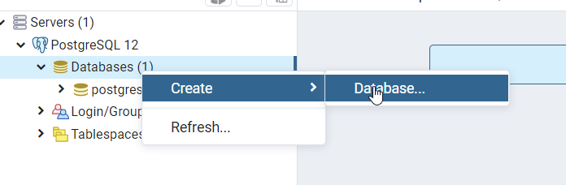
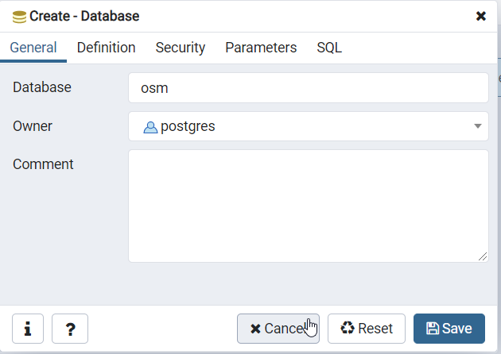
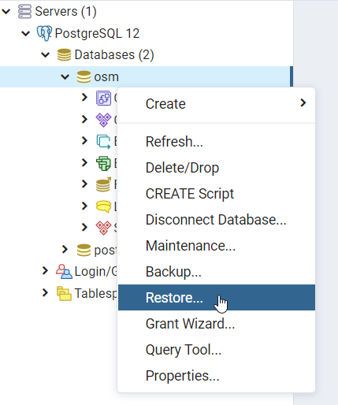
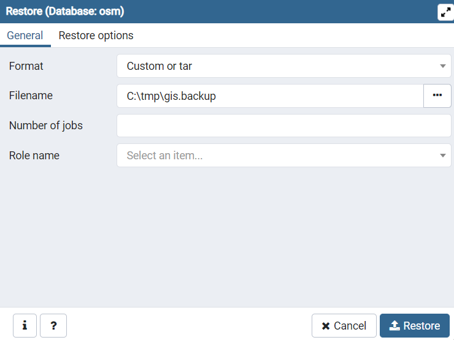
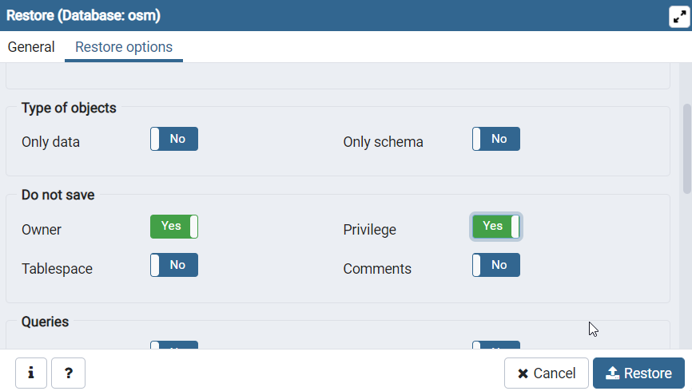

## Using the dump-pg.sh tool to build a PostgreSQL database dump that can be restored on Windows

The [imposm 3](https://imposm.org/) utility used to turn the binary OSM dump into a layered, optimized PostgreSQL database for GeoServer currently runs only on Linux.
However you might want to run PostgreSQL (and possibly GeoServer too) on Windows instead.

This folder contains a small utility, called ``dump-pg.sh``, that can be used to prepare an OSM database dump on a Linux machine, which can then be restored on a Windows machine.

In order to use it, one needs to have Docker installed and running, as the PostGIS database
will run in a local Docker container.


The command self-describes as follows (when run without parameters):

```
Usage dump-pg.sh -i osm_pbf_location [-p postgresqlPort] [-c postgresqlContainerName]
  -i Location of the PBF file to import
  -p Local port to use for the PostgreSQL container, defaults to 25432
  -v Version of the Kartoza PostGIS Image to be used, defaults to 12.1
  -c Name of the container used for the PostgreSQL container, defaults to osm-postgis
  -r Remove the database container and its data after import, either true or false, defaults to true
```

For the restore to work properly attention must be paid to the **version numbers**, PostgreSQL can
restore a backup made from the same version, from earlier versions, but not from later versions.
For example, if the target PostgreSQL running on Windows is a version 11, doing a backup using version 11 or 10 will work, but a backup from version 12 may fail to restore.  

The Kartoza PostGIS images used to run the import and backup can be [found on dockerhub](https://hub.docker.com/r/kartoza/postgis/tags) with a variety of versions of PostgreSQL and PostGIS to choose from.


### Running the import and database dump

1. Download the desired area from the [GeoFabrik server](https://download.geofabrik.de/). For doing quick tests, a small country is preferred, e.g., [Albania](https://download.geofabrik.de/europe/albania-latest.osm.pbf).
2. Go on the terminal, and change into the ``osm-styles/imposm`` directory.
3. Run the tool from the command line, specifying the location of the PBF file, e.g.:

```
./dump-pg.sh -i /path/to/albania-latest.osm.pbf 
```
4. Wait for the processing to occurr, the output will look similar to:

```
---------- Using user id 1000 and username yourUser

----------- Starting up PostGIS docker image osm-postgis
e4bbcc93bd7a29b9ae53874d3cc4bf483fa9e6131e6ddcc6378088078f431044

----------- Downloading and unpacking Imposm 3
imposm-0.10.0-linux-x86-64.tar.gz                           100%[=========================================================================================================================================>]  16,34M   275KB/s    in 27s     
Done

----------- Waiting for PostgreSQL to be up and running

----------- Running imposm, read from pbf
[2020-03-25T15:41:58+01:00] 0:00:00 [warn]: exclude_tags filter is deprecated and will be removed. See require and reject filter.
[2020-03-25T15:41:58+01:00] 0:00:00 [warn]: exclude_tags filter is deprecated and will be removed. See require and reject filter.
[2020-03-25T15:41:58+01:00] 0:00:00 [warn]: exclude_tags filter is deprecated and will be removed. See require and reject filter.
[2020-03-25T15:41:58+01:00] 0:00:00 [warn] pseudoarea type is deprecated and will be removed. See area and webmerc_area type.
[2020-03-25T15:41:58+01:00] 0:00:00 [warn]: exclude_tags filter is deprecated and will be removed. See require and reject filter.
[2020-03-25T15:41:58+01:00] 0:00:00 [warn]: exclude_tags filter is deprecated and will be removed. See require and reject filter.
[2020-03-25T15:41:58+01:00] 0:00:00 [step] Starting: Imposm
[2020-03-25T15:41:58+01:00] 0:00:00 [step] Starting: Reading OSM data
[2020-03-25T15:41:58+01:00] 0:00:00 [info] reading /path/to/albania-latest.osm.pbf with data till 2020-03-04 22:59:03 +0100 CET
[2020-03-25T15:42:01+01:00] 0:00:02 [progress]     2s C:       0/s (6168851) N:       0/s (38959) W:       0/s (385041) R:      0/s (1786)
[2020-03-25T15:42:01+01:00] 0:00:02 [step] Finished: Reading OSM data in 2.937524196s
[2020-03-25T15:42:01+01:00] 0:00:02 [step] Finished: Imposm in 2.937565083s

----------- Running imposm, write to database
[2020-03-25T15:42:01+01:00] 0:00:00 [warn]: exclude_tags filter is deprecated and will be removed. See require and reject filter.
[2020-03-25T15:42:01+01:00] 0:00:00 [warn]: exclude_tags filter is deprecated and will be removed. See require and reject filter.
[2020-03-25T15:42:01+01:00] 0:00:00 [warn]: exclude_tags filter is deprecated and will be removed. See require and reject filter.
[2020-03-25T15:42:01+01:00] 0:00:00 [warn] pseudoarea type is deprecated and will be removed. See area and webmerc_area type.
[2020-03-25T15:42:01+01:00] 0:00:00 [warn]: exclude_tags filter is deprecated and will be removed. See require and reject filter.
[2020-03-25T15:42:01+01:00] 0:00:00 [warn]: exclude_tags filter is deprecated and will be removed. See require and reject filter.
[2020-03-25T15:42:01+01:00] 0:00:00 [warn] pseudoarea type is deprecated and will be removed. See area and webmerc_area type.
[2020-03-25T15:42:01+01:00] 0:00:00 [step] Starting: Imposm
[2020-03-25T15:42:01+01:00] 0:00:00 [step] Starting: Importing OSM data
[2020-03-25T15:42:01+01:00] 0:00:00 [step] Starting: Writing OSM data
[2020-03-25T15:42:14+01:00] 0:00:13 [step] Finished: Writing OSM data in 13.165211392s
[2020-03-25T15:42:14+01:00] 0:00:13 [step] Starting: Creating generalized tables
[2020-03-25T15:42:14+01:00] 0:00:13 [progress]    13s C:       0/s (0) N:       0/s (38959) W:       0/s (385041) R:      0/s (1786)
[2020-03-25T15:42:14+01:00] 0:00:13 [step] Starting: Generalizing osm_landusages into osm_landusages_gen1
[2020-03-25T15:42:14+01:00] 0:00:13 [step] Starting: Generalizing osm_roads into osm_roads_gen3
[2020-03-25T15:42:14+01:00] 0:00:13 [step] Starting: Generalizing osm_waterareas into osm_waterareas_gen1
[2020-03-25T15:42:14+01:00] 0:00:13 [step] Starting: Generalizing osm_waterways into osm_waterways_gen1
[2020-03-25T15:42:15+01:00] 0:00:13 [step] Finished: Generalizing osm_waterways into osm_waterways_gen1 in 545.762474ms
[2020-03-25T15:42:15+01:00] 0:00:13 [step] Finished: Generalizing osm_roads into osm_roads_gen3 in 593.909826ms
[2020-03-25T15:42:15+01:00] 0:00:13 [step] Finished: Generalizing osm_waterareas into osm_waterareas_gen1 in 739.048668ms
[2020-03-25T15:42:16+01:00] 0:00:14 [step] Finished: Generalizing osm_landusages into osm_landusages_gen1 in 1.637758846s
[2020-03-25T15:42:16+01:00] 0:00:14 [step] Starting: Generalizing osm_waterareas into osm_waterareas_gen0
[2020-03-25T15:42:16+01:00] 0:00:14 [step] Starting: Generalizing osm_roads into osm_roads_gen2
[2020-03-25T15:42:16+01:00] 0:00:14 [step] Starting: Generalizing osm_waterways into osm_waterways_gen0
[2020-03-25T15:42:16+01:00] 0:00:14 [step] Starting: Generalizing osm_landusages into osm_landusages_gen0
[2020-03-25T15:42:16+01:00] 0:00:15 [step] Finished: Generalizing osm_waterareas into osm_waterareas_gen0 in 230.100281ms
[2020-03-25T15:42:16+01:00] 0:00:15 [step] Finished: Generalizing osm_waterways into osm_waterways_gen0 in 248.803353ms
[2020-03-25T15:42:16+01:00] 0:00:15 [step] Finished: Generalizing osm_roads into osm_roads_gen2 in 271.544524ms
[2020-03-25T15:42:16+01:00] 0:00:15 [step] Finished: Generalizing osm_landusages into osm_landusages_gen0 in 575.24669ms
[2020-03-25T15:42:16+01:00] 0:00:15 [step] Starting: Generalizing osm_roads into osm_roads_gen1
[2020-03-25T15:42:16+01:00] 0:00:15 [step] Finished: Generalizing osm_roads into osm_roads_gen1 in 141.635902ms
[2020-03-25T15:42:16+01:00] 0:00:15 [step] Starting: Generalizing osm_roads into osm_roads_gen0
[2020-03-25T15:42:17+01:00] 0:00:15 [step] Finished: Generalizing osm_roads into osm_roads_gen0 in 136.051585ms
[2020-03-25T15:42:17+01:00] 0:00:15 [step] Finished: Creating generalized tables in 2.491146727s
[2020-03-25T15:42:17+01:00] 0:00:15 [step] Starting: Creating geometry indices
[2020-03-25T15:42:17+01:00] 0:00:15 [step] Starting: Creating geometry index on osm_landusages
[2020-03-25T15:42:17+01:00] 0:00:15 [step] Starting: Creating geometry index on osm_waterways
[2020-03-25T15:42:17+01:00] 0:00:15 [step] Starting: Creating geometry index on osm_transport_points
[2020-03-25T15:42:17+01:00] 0:00:15 [step] Starting: Creating OSM id index on osm_waterways_gen0
[2020-03-25T15:42:17+01:00] 0:00:15 [step] Starting: Creating geometry index on osm_housenumbers_interpolated
[2020-03-25T15:42:17+01:00] 0:00:15 [step] Starting: Creating geometry index on osm_barrierways
[2020-03-25T15:42:17+01:00] 0:00:15 [step] Starting: Creating geometry index on osm_buildings
[2020-03-25T15:42:17+01:00] 0:00:15 [step] Starting: Creating geometry index on osm_places
[2020-03-25T15:42:17+01:00] 0:00:15 [step] Starting: Creating geometry index on osm_transport_areas
[2020-03-25T15:42:17+01:00] 0:00:15 [step] Starting: Creating geometry index on osm_roads
[2020-03-25T15:42:17+01:00] 0:00:15 [step] Starting: Creating geometry index on osm_amenities
[2020-03-25T15:42:17+01:00] 0:00:15 [step] Starting: Creating geometry index on osm_housenumbers
[2020-03-25T15:42:17+01:00] 0:00:15 [step] Starting: Creating geometry index on osm_admin
[2020-03-25T15:42:17+01:00] 0:00:15 [step] Starting: Creating geometry index on osm_barrierpoints
[2020-03-25T15:42:17+01:00] 0:00:15 [step] Starting: Creating geometry index on osm_boundary
[2020-03-25T15:42:17+01:00] 0:00:15 [step] Starting: Creating geometry index on osm_waterareas
[2020-03-25T15:42:17+01:00] 0:00:15 [step] Finished: Creating geometry index on osm_waterways in 58.667965ms
[2020-03-25T15:42:17+01:00] 0:00:15 [step] Starting: Creating OSM id index on osm_roads_gen0
[2020-03-25T15:42:17+01:00] 0:00:15 [step] Finished: Creating geometry index on osm_transport_points in 87.959298ms
[2020-03-25T15:42:17+01:00] 0:00:15 [step] Starting: Creating OSM id index on osm_landusages_gen1
[2020-03-25T15:42:17+01:00] 0:00:15 [step] Finished: Creating OSM id index on osm_waterways_gen0 in 88.058163ms
[2020-03-25T15:42:17+01:00] 0:00:15 [step] Starting: Creating geometry index on osm_waterways_gen0
[2020-03-25T15:42:17+01:00] 0:00:15 [step] Finished: Creating geometry index on osm_waterareas in 88.099762ms
[2020-03-25T15:42:17+01:00] 0:00:15 [step] Finished: Creating geometry index on osm_places in 88.174833ms
[2020-03-25T15:42:17+01:00] 0:00:15 [step] Starting: Creating OSM id index on osm_waterareas_gen1
[2020-03-25T15:42:17+01:00] 0:00:15 [step] Finished: Creating geometry index on osm_boundary in 88.203367ms
[2020-03-25T15:42:17+01:00] 0:00:15 [step] Finished: Creating geometry index on osm_barrierways in 88.238443ms
[2020-03-25T15:42:17+01:00] 0:00:15 [step] Starting: Creating OSM id index on osm_waterareas_gen0
[2020-03-25T15:42:17+01:00] 0:00:15 [step] Starting: Creating OSM id index on osm_roads_gen3
[2020-03-25T15:42:17+01:00] 0:00:15 [step] Finished: Creating geometry index on osm_housenumbers_interpolated in 88.185082ms
[2020-03-25T15:42:17+01:00] 0:00:15 [step] Starting: Creating OSM id index on osm_roads_gen1
[2020-03-25T15:42:17+01:00] 0:00:15 [step] Starting: Creating OSM id index on osm_waterways_gen1
[2020-03-25T15:42:17+01:00] 0:00:15 [step] Finished: Creating geometry index on osm_barrierpoints in 88.196744ms
[2020-03-25T15:42:17+01:00] 0:00:15 [step] Starting: Creating OSM id index on osm_roads_gen2
[2020-03-25T15:42:17+01:00] 0:00:15 [step] Finished: Creating geometry index on osm_admin in 88.167219ms
[2020-03-25T15:42:17+01:00] 0:00:15 [step] Starting: Creating OSM id index on osm_landusages_gen0
[2020-03-25T15:42:17+01:00] 0:00:15 [step] Finished: Creating geometry index on osm_transport_areas in 88.190643ms
[2020-03-25T15:42:17+01:00] 0:00:15 [step] Finished: Creating geometry index on osm_waterways_gen0 in 125.712089ms
[2020-03-25T15:42:17+01:00] 0:00:15 [step] Finished: Creating OSM id index on osm_roads_gen0 in 176.65405ms
[2020-03-25T15:42:17+01:00] 0:00:15 [step] Starting: Creating geometry index on osm_roads_gen0
[2020-03-25T15:42:17+01:00] 0:00:15 [step] Finished: Creating geometry index on osm_housenumbers in 245.118808ms
[2020-03-25T15:42:17+01:00] 0:00:15 [step] Finished: Creating OSM id index on osm_landusages_gen0 in 166.811001ms
[2020-03-25T15:42:17+01:00] 0:00:15 [step] Starting: Creating geometry index on osm_landusages_gen0
[2020-03-25T15:42:17+01:00] 0:00:15 [step] Finished: Creating OSM id index on osm_waterareas_gen0 in 167.360416ms
[2020-03-25T15:42:17+01:00] 0:00:15 [step] Starting: Creating geometry index on osm_waterareas_gen0
[2020-03-25T15:42:17+01:00] 0:00:15 [step] Finished: Creating OSM id index on osm_waterways_gen1 in 167.450796ms
[2020-03-25T15:42:17+01:00] 0:00:15 [step] Starting: Creating geometry index on osm_waterways_gen1
[2020-03-25T15:42:17+01:00] 0:00:15 [step] Finished: Creating OSM id index on osm_waterareas_gen1 in 167.459492ms
[2020-03-25T15:42:17+01:00] 0:00:15 [step] Starting: Creating geometry index on osm_waterareas_gen1
[2020-03-25T15:42:17+01:00] 0:00:15 [step] Finished: Creating OSM id index on osm_roads_gen2 in 178.739527ms
[2020-03-25T15:42:17+01:00] 0:00:15 [step] Starting: Creating geometry index on osm_roads_gen2
[2020-03-25T15:42:17+01:00] 0:00:15 [step] Finished: Creating OSM id index on osm_roads_gen3 in 179.344937ms
[2020-03-25T15:42:17+01:00] 0:00:15 [step] Starting: Creating geometry index on osm_roads_gen3
[2020-03-25T15:42:17+01:00] 0:00:15 [step] Finished: Creating OSM id index on osm_roads_gen1 in 179.117238ms
[2020-03-25T15:42:17+01:00] 0:00:15 [step] Starting: Creating geometry index on osm_roads_gen1
[2020-03-25T15:42:17+01:00] 0:00:15 [step] Finished: Creating OSM id index on osm_landusages_gen1 in 179.632658ms
[2020-03-25T15:42:17+01:00] 0:00:15 [step] Starting: Creating geometry index on osm_landusages_gen1
[2020-03-25T15:42:17+01:00] 0:00:15 [step] Finished: Creating geometry index on osm_landusages in 267.735005ms
[2020-03-25T15:42:17+01:00] 0:00:15 [step] Finished: Creating geometry index on osm_waterareas_gen0 in 20.72217ms
[2020-03-25T15:42:17+01:00] 0:00:15 [step] Finished: Creating geometry index on osm_landusages_gen0 in 20.838089ms
[2020-03-25T15:42:17+01:00] 0:00:15 [step] Finished: Creating geometry index on osm_amenities in 285.781539ms
[2020-03-25T15:42:17+01:00] 0:00:15 [step] Finished: Creating geometry index on osm_roads_gen0 in 50.478109ms
[2020-03-25T15:42:17+01:00] 0:00:15 [step] Finished: Creating geometry index on osm_waterways_gen1 in 38.403657ms
[2020-03-25T15:42:17+01:00] 0:00:15 [step] Finished: Creating geometry index on osm_waterareas_gen1 in 46.756882ms
[2020-03-25T15:42:17+01:00] 0:00:15 [step] Finished: Creating geometry index on osm_roads_gen1 in 43.922376ms
[2020-03-25T15:42:17+01:00] 0:00:15 [step] Finished: Creating geometry index on osm_roads_gen2 in 53.268009ms
[2020-03-25T15:42:17+01:00] 0:00:15 [step] Finished: Creating geometry index on osm_landusages_gen1 in 62.463421ms
[2020-03-25T15:42:17+01:00] 0:00:16 [step] Finished: Creating geometry index on osm_roads_gen3 in 73.178211ms
[2020-03-25T15:42:18+01:00] 0:00:17 [step] Finished: Creating geometry index on osm_roads in 1.384418289s
[2020-03-25T15:42:18+01:00] 0:00:17 [step] Finished: Creating geometry index on osm_buildings in 1.542159162s
[2020-03-25T15:42:18+01:00] 0:00:17 [step] Finished: Creating geometry indices in 1.542338489s
[2020-03-25T15:42:18+01:00] 0:00:17 [step] Finished: Importing OSM data in 17.198796416s
[2020-03-25T15:42:18+01:00] 0:00:17 [step] Finished: Imposm in 17.198827635s

----------- Deploy imported tables to production
[2020-03-25T15:42:18+01:00] 0:00:00 [warn]: exclude_tags filter is deprecated and will be removed. See require and reject filter.
[2020-03-25T15:42:18+01:00] 0:00:00 [warn]: exclude_tags filter is deprecated and will be removed. See require and reject filter.
[2020-03-25T15:42:18+01:00] 0:00:00 [warn]: exclude_tags filter is deprecated and will be removed. See require and reject filter.
[2020-03-25T15:42:18+01:00] 0:00:00 [warn] pseudoarea type is deprecated and will be removed. See area and webmerc_area type.
[2020-03-25T15:42:18+01:00] 0:00:00 [warn]: exclude_tags filter is deprecated and will be removed. See require and reject filter.
[2020-03-25T15:42:18+01:00] 0:00:00 [warn]: exclude_tags filter is deprecated and will be removed. See require and reject filter.
[2020-03-25T15:42:18+01:00] 0:00:00 [warn] pseudoarea type is deprecated and will be removed. See area and webmerc_area type.
[2020-03-25T15:42:18+01:00] 0:00:00 [step] Starting: Imposm
[2020-03-25T15:42:18+01:00] 0:00:00 [step] Starting: Rotating tables
[2020-03-25T15:42:18+01:00] 0:00:00 [info] Rotating osm_buildings from import -> public -> backup
[2020-03-25T15:42:18+01:00] 0:00:00 [info] Rotating osm_housenumbers_interpolated from import -> public -> backup
[2020-03-25T15:42:18+01:00] 0:00:00 [info] Rotating osm_waterways from import -> public -> backup
[2020-03-25T15:42:18+01:00] 0:00:00 [info] Rotating osm_barrierways from import -> public -> backup
[2020-03-25T15:42:18+01:00] 0:00:00 [info] Rotating osm_amenities from import -> public -> backup
[2020-03-25T15:42:18+01:00] 0:00:00 [info] Rotating osm_barrierpoints from import -> public -> backup
[2020-03-25T15:42:18+01:00] 0:00:00 [info] Rotating osm_places from import -> public -> backup
[2020-03-25T15:42:18+01:00] 0:00:00 [info] Rotating osm_boundary from import -> public -> backup
[2020-03-25T15:42:18+01:00] 0:00:00 [info] Rotating osm_waterareas from import -> public -> backup
[2020-03-25T15:42:18+01:00] 0:00:00 [info] Rotating osm_transport_areas from import -> public -> backup
[2020-03-25T15:42:18+01:00] 0:00:00 [info] Rotating osm_transport_points from import -> public -> backup
[2020-03-25T15:42:18+01:00] 0:00:00 [info] Rotating osm_admin from import -> public -> backup
[2020-03-25T15:42:18+01:00] 0:00:00 [info] Rotating osm_landusages from import -> public -> backup
[2020-03-25T15:42:18+01:00] 0:00:00 [info] Rotating osm_housenumbers from import -> public -> backup
[2020-03-25T15:42:18+01:00] 0:00:00 [info] Rotating osm_roads from import -> public -> backup
[2020-03-25T15:42:18+01:00] 0:00:00 [info] Rotating osm_roads_gen2 from import -> public -> backup
[2020-03-25T15:42:18+01:00] 0:00:00 [info] Rotating osm_roads_gen3 from import -> public -> backup
[2020-03-25T15:42:18+01:00] 0:00:00 [info] Rotating osm_landusages_gen0 from import -> public -> backup
[2020-03-25T15:42:18+01:00] 0:00:00 [info] Rotating osm_roads_gen0 from import -> public -> backup
[2020-03-25T15:42:18+01:00] 0:00:00 [info] Rotating osm_waterways_gen1 from import -> public -> backup
[2020-03-25T15:42:18+01:00] 0:00:00 [info] Rotating osm_waterareas_gen0 from import -> public -> backup
[2020-03-25T15:42:18+01:00] 0:00:00 [info] Rotating osm_waterways_gen0 from import -> public -> backup
[2020-03-25T15:42:18+01:00] 0:00:00 [info] Rotating osm_waterareas_gen1 from import -> public -> backup
[2020-03-25T15:42:18+01:00] 0:00:00 [info] Rotating osm_roads_gen1 from import -> public -> backup
[2020-03-25T15:42:18+01:00] 0:00:00 [info] Rotating osm_landusages_gen1 from import -> public -> backup
[2020-03-25T15:42:18+01:00] 0:00:00 [step] Finished: Rotating tables in 58.150879ms
[2020-03-25T15:42:18+01:00] 0:00:00 [step] Finished: Imposm in 58.216603ms

----------- Remove backup scheme
[2020-03-25T15:42:18+01:00] 0:00:00 [warn]: exclude_tags filter is deprecated and will be removed. See require and reject filter.
[2020-03-25T15:42:18+01:00] 0:00:00 [warn]: exclude_tags filter is deprecated and will be removed. See require and reject filter.
[2020-03-25T15:42:18+01:00] 0:00:00 [warn]: exclude_tags filter is deprecated and will be removed. See require and reject filter.
[2020-03-25T15:42:18+01:00] 0:00:00 [warn] pseudoarea type is deprecated and will be removed. See area and webmerc_area type.
[2020-03-25T15:42:18+01:00] 0:00:00 [warn]: exclude_tags filter is deprecated and will be removed. See require and reject filter.
[2020-03-25T15:42:18+01:00] 0:00:00 [warn]: exclude_tags filter is deprecated and will be removed. See require and reject filter.
[2020-03-25T15:42:18+01:00] 0:00:00 [warn] pseudoarea type is deprecated and will be removed. See area and webmerc_area type.
[2020-03-25T15:42:18+01:00] 0:00:00 [step] Starting: Imposm
[2020-03-25T15:42:18+01:00] 0:00:00 [step] Finished: Imposm in 17.904384ms

----------- Dumping the backup
pg_dump: last built-in OID is 16383
pg_dump: reading extensions
pg_dump: identifying extension members
pg_dump: reading schemas
pg_dump: reading user-defined tables
pg_dump: reading user-defined functions
pg_dump: reading user-defined types
pg_dump: reading procedural languages
pg_dump: reading user-defined aggregate functions
pg_dump: reading user-defined operators
pg_dump: reading user-defined access methods
pg_dump: reading user-defined operator classes
pg_dump: reading user-defined operator families
pg_dump: reading user-defined text search parsers
pg_dump: reading user-defined text search templates
pg_dump: reading user-defined text search dictionaries
pg_dump: reading user-defined text search configurations
pg_dump: reading user-defined foreign-data wrappers
pg_dump: reading user-defined foreign servers
pg_dump: reading default privileges
pg_dump: reading user-defined collations
pg_dump: reading user-defined conversions
pg_dump: reading type casts
pg_dump: reading transforms
pg_dump: reading table inheritance information
pg_dump: reading event triggers
pg_dump: finding extension tables
pg_dump: finding inheritance relationships
pg_dump: reading column info for interesting tables
pg_dump: finding the columns and types of table "public.spatial_ref_sys"
pg_dump: finding check constraints for table "public.spatial_ref_sys"
pg_dump: finding the columns and types of table "public.geography_columns"
pg_dump: finding the columns and types of table "public.geometry_columns"
pg_dump: finding the columns and types of table "topology.topology"
pg_dump: finding default expressions of table "topology.topology"
pg_dump: finding the columns and types of table "topology.layer"
pg_dump: finding default expressions of table "topology.layer"
pg_dump: finding the columns and types of table "public.raster_columns"
pg_dump: finding the columns and types of table "public.raster_overviews"
pg_dump: finding the columns and types of table "public.osm_waterways"
pg_dump: finding default expressions of table "public.osm_waterways"
pg_dump: finding the columns and types of table "public.osm_housenumbers_interpolated"
pg_dump: finding default expressions of table "public.osm_housenumbers_interpolated"
pg_dump: finding the columns and types of table "public.osm_places"
pg_dump: finding default expressions of table "public.osm_places"
pg_dump: finding the columns and types of table "public.osm_boundary"
pg_dump: finding default expressions of table "public.osm_boundary"
pg_dump: finding the columns and types of table "public.osm_barrierpoints"
pg_dump: finding default expressions of table "public.osm_barrierpoints"
pg_dump: finding the columns and types of table "public.osm_landusages"
pg_dump: finding default expressions of table "public.osm_landusages"
pg_dump: finding the columns and types of table "public.osm_waterareas"
pg_dump: finding default expressions of table "public.osm_waterareas"
pg_dump: finding the columns and types of table "public.osm_roads"
pg_dump: finding default expressions of table "public.osm_roads"
pg_dump: finding the columns and types of table "public.osm_transport_areas"
pg_dump: finding default expressions of table "public.osm_transport_areas"
pg_dump: finding the columns and types of table "public.osm_amenities"
pg_dump: finding default expressions of table "public.osm_amenities"
pg_dump: finding the columns and types of table "public.osm_buildings"
pg_dump: finding default expressions of table "public.osm_buildings"
pg_dump: finding the columns and types of table "public.osm_housenumbers"
pg_dump: finding default expressions of table "public.osm_housenumbers"
pg_dump: finding the columns and types of table "public.osm_admin"
pg_dump: finding default expressions of table "public.osm_admin"
pg_dump: finding the columns and types of table "public.osm_transport_points"
pg_dump: finding default expressions of table "public.osm_transport_points"
pg_dump: finding the columns and types of table "public.osm_barrierways"
pg_dump: finding default expressions of table "public.osm_barrierways"
pg_dump: finding the columns and types of table "public.osm_roads_gen3"
pg_dump: finding the columns and types of table "public.osm_waterways_gen1"
pg_dump: finding the columns and types of table "public.osm_landusages_gen1"
pg_dump: finding the columns and types of table "public.osm_waterareas_gen1"
pg_dump: finding the columns and types of table "public.osm_roads_gen2"
pg_dump: finding the columns and types of table "public.osm_waterareas_gen0"
pg_dump: finding the columns and types of table "public.osm_waterways_gen0"
pg_dump: finding the columns and types of table "public.osm_landusages_gen0"
pg_dump: finding the columns and types of table "public.osm_roads_gen1"
pg_dump: finding the columns and types of table "public.osm_roads_gen0"
pg_dump: flagging inherited columns in subtables
pg_dump: reading indexes
pg_dump: reading indexes for table "public.spatial_ref_sys"
pg_dump: reading indexes for table "topology.topology"
pg_dump: reading indexes for table "topology.layer"
pg_dump: reading indexes for table "public.osm_waterways"
pg_dump: reading indexes for table "public.osm_housenumbers_interpolated"
pg_dump: reading indexes for table "public.osm_places"
pg_dump: reading indexes for table "public.osm_boundary"
pg_dump: reading indexes for table "public.osm_barrierpoints"
pg_dump: reading indexes for table "public.osm_landusages"
pg_dump: reading indexes for table "public.osm_waterareas"
pg_dump: reading indexes for table "public.osm_roads"
pg_dump: reading indexes for table "public.osm_transport_areas"
pg_dump: reading indexes for table "public.osm_amenities"
pg_dump: reading indexes for table "public.osm_buildings"
pg_dump: reading indexes for table "public.osm_housenumbers"
pg_dump: reading indexes for table "public.osm_admin"
pg_dump: reading indexes for table "public.osm_transport_points"
pg_dump: reading indexes for table "public.osm_barrierways"
pg_dump: reading indexes for table "public.osm_roads_gen3"
pg_dump: reading indexes for table "public.osm_waterways_gen1"
pg_dump: reading indexes for table "public.osm_landusages_gen1"
pg_dump: reading indexes for table "public.osm_waterareas_gen1"
pg_dump: reading indexes for table "public.osm_roads_gen2"
pg_dump: reading indexes for table "public.osm_waterareas_gen0"
pg_dump: reading indexes for table "public.osm_waterways_gen0"
pg_dump: reading indexes for table "public.osm_landusages_gen0"
pg_dump: reading indexes for table "public.osm_roads_gen1"
pg_dump: reading indexes for table "public.osm_roads_gen0"
pg_dump: flagging indexes in partitioned tables
pg_dump: reading extended statistics
pg_dump: reading constraints
pg_dump: reading triggers
pg_dump: reading rewrite rules
pg_dump: reading policies
pg_dump: reading row security enabled for table "public.spatial_ref_sys"
pg_dump: reading policies for table "public.spatial_ref_sys"
pg_dump: reading row security enabled for table "public.geography_columns"
pg_dump: reading policies for table "public.geography_columns"
pg_dump: reading row security enabled for table "public.geometry_columns"
pg_dump: reading policies for table "public.geometry_columns"
pg_dump: reading row security enabled for table "topology.topology_id_seq"
pg_dump: reading policies for table "topology.topology_id_seq"
pg_dump: reading row security enabled for table "topology.topology"
pg_dump: reading policies for table "topology.topology"
pg_dump: reading row security enabled for table "topology.layer"
pg_dump: reading policies for table "topology.layer"
pg_dump: reading row security enabled for table "public.raster_columns"
pg_dump: reading policies for table "public.raster_columns"
pg_dump: reading row security enabled for table "public.raster_overviews"
pg_dump: reading policies for table "public.raster_overviews"
pg_dump: reading row security enabled for table "public.osm_waterways_id_seq"
pg_dump: reading policies for table "public.osm_waterways_id_seq"
pg_dump: reading row security enabled for table "public.osm_waterways"
pg_dump: reading policies for table "public.osm_waterways"
pg_dump: reading row security enabled for table "public.osm_housenumbers_interpolated_id_seq"
pg_dump: reading policies for table "public.osm_housenumbers_interpolated_id_seq"
pg_dump: reading row security enabled for table "public.osm_housenumbers_interpolated"
pg_dump: reading policies for table "public.osm_housenumbers_interpolated"
pg_dump: reading row security enabled for table "public.osm_places_id_seq"
pg_dump: reading policies for table "public.osm_places_id_seq"
pg_dump: reading row security enabled for table "public.osm_places"
pg_dump: reading policies for table "public.osm_places"
pg_dump: reading row security enabled for table "public.osm_boundary_id_seq"
pg_dump: reading policies for table "public.osm_boundary_id_seq"
pg_dump: reading row security enabled for table "public.osm_boundary"
pg_dump: reading policies for table "public.osm_boundary"
pg_dump: reading row security enabled for table "public.osm_barrierpoints_id_seq"
pg_dump: reading policies for table "public.osm_barrierpoints_id_seq"
pg_dump: reading row security enabled for table "public.osm_barrierpoints"
pg_dump: reading policies for table "public.osm_barrierpoints"
pg_dump: reading row security enabled for table "public.osm_landusages_id_seq"
pg_dump: reading policies for table "public.osm_landusages_id_seq"
pg_dump: reading row security enabled for table "public.osm_landusages"
pg_dump: reading policies for table "public.osm_landusages"
pg_dump: reading row security enabled for table "public.osm_waterareas_id_seq"
pg_dump: reading policies for table "public.osm_waterareas_id_seq"
pg_dump: reading row security enabled for table "public.osm_waterareas"
pg_dump: reading policies for table "public.osm_waterareas"
pg_dump: reading row security enabled for table "public.osm_roads_id_seq"
pg_dump: reading policies for table "public.osm_roads_id_seq"
pg_dump: reading row security enabled for table "public.osm_roads"
pg_dump: reading policies for table "public.osm_roads"
pg_dump: reading row security enabled for table "public.osm_transport_areas_id_seq"
pg_dump: reading policies for table "public.osm_transport_areas_id_seq"
pg_dump: reading row security enabled for table "public.osm_transport_areas"
pg_dump: reading policies for table "public.osm_transport_areas"
pg_dump: reading row security enabled for table "public.osm_amenities_id_seq"
pg_dump: reading policies for table "public.osm_amenities_id_seq"
pg_dump: reading row security enabled for table "public.osm_amenities"
pg_dump: reading policies for table "public.osm_amenities"
pg_dump: reading row security enabled for table "public.osm_buildings_id_seq"
pg_dump: reading policies for table "public.osm_buildings_id_seq"
pg_dump: reading row security enabled for table "public.osm_buildings"
pg_dump: reading policies for table "public.osm_buildings"
pg_dump: reading row security enabled for table "public.osm_housenumbers_id_seq"
pg_dump: reading policies for table "public.osm_housenumbers_id_seq"
pg_dump: reading row security enabled for table "public.osm_housenumbers"
pg_dump: reading policies for table "public.osm_housenumbers"
pg_dump: reading row security enabled for table "public.osm_admin_id_seq"
pg_dump: reading policies for table "public.osm_admin_id_seq"
pg_dump: reading row security enabled for table "public.osm_admin"
pg_dump: reading policies for table "public.osm_admin"
pg_dump: reading row security enabled for table "public.osm_transport_points_id_seq"
pg_dump: reading policies for table "public.osm_transport_points_id_seq"
pg_dump: reading row security enabled for table "public.osm_transport_points"
pg_dump: reading policies for table "public.osm_transport_points"
pg_dump: reading row security enabled for table "public.osm_barrierways_id_seq"
pg_dump: reading policies for table "public.osm_barrierways_id_seq"
pg_dump: reading row security enabled for table "public.osm_barrierways"
pg_dump: reading policies for table "public.osm_barrierways"
pg_dump: reading row security enabled for table "public.osm_roads_gen3"
pg_dump: reading policies for table "public.osm_roads_gen3"
pg_dump: reading row security enabled for table "public.osm_waterways_gen1"
pg_dump: reading policies for table "public.osm_waterways_gen1"
pg_dump: reading row security enabled for table "public.osm_landusages_gen1"
pg_dump: reading policies for table "public.osm_landusages_gen1"
pg_dump: reading row security enabled for table "public.osm_waterareas_gen1"
pg_dump: reading policies for table "public.osm_waterareas_gen1"
pg_dump: reading row security enabled for table "public.osm_roads_gen2"
pg_dump: reading policies for table "public.osm_roads_gen2"
pg_dump: reading row security enabled for table "public.osm_waterareas_gen0"
pg_dump: reading policies for table "public.osm_waterareas_gen0"
pg_dump: reading row security enabled for table "public.osm_waterways_gen0"
pg_dump: reading policies for table "public.osm_waterways_gen0"
pg_dump: reading row security enabled for table "public.osm_landusages_gen0"
pg_dump: reading policies for table "public.osm_landusages_gen0"
pg_dump: reading row security enabled for table "public.osm_roads_gen1"
pg_dump: reading policies for table "public.osm_roads_gen1"
pg_dump: reading row security enabled for table "public.osm_roads_gen0"
pg_dump: reading policies for table "public.osm_roads_gen0"
pg_dump: reading publications
pg_dump: reading publication membership
pg_dump: reading publication membership for table "public.osm_waterways"
pg_dump: reading publication membership for table "public.osm_housenumbers_interpolated"
pg_dump: reading publication membership for table "public.osm_places"
pg_dump: reading publication membership for table "public.osm_boundary"
pg_dump: reading publication membership for table "public.osm_barrierpoints"
pg_dump: reading publication membership for table "public.osm_landusages"
pg_dump: reading publication membership for table "public.osm_waterareas"
pg_dump: reading publication membership for table "public.osm_roads"
pg_dump: reading publication membership for table "public.osm_transport_areas"
pg_dump: reading publication membership for table "public.osm_amenities"
pg_dump: reading publication membership for table "public.osm_buildings"
pg_dump: reading publication membership for table "public.osm_housenumbers"
pg_dump: reading publication membership for table "public.osm_admin"
pg_dump: reading publication membership for table "public.osm_transport_points"
pg_dump: reading publication membership for table "public.osm_barrierways"
pg_dump: reading publication membership for table "public.osm_roads_gen3"
pg_dump: reading publication membership for table "public.osm_waterways_gen1"
pg_dump: reading publication membership for table "public.osm_landusages_gen1"
pg_dump: reading publication membership for table "public.osm_waterareas_gen1"
pg_dump: reading publication membership for table "public.osm_roads_gen2"
pg_dump: reading publication membership for table "public.osm_waterareas_gen0"
pg_dump: reading publication membership for table "public.osm_waterways_gen0"
pg_dump: reading publication membership for table "public.osm_landusages_gen0"
pg_dump: reading publication membership for table "public.osm_roads_gen1"
pg_dump: reading publication membership for table "public.osm_roads_gen0"
pg_dump: reading subscriptions
pg_dump: reading large objects
pg_dump: reading dependency data
pg_dump: saving encoding = UTF8
pg_dump: saving standard_conforming_strings = on
pg_dump: saving search_path = 
pg_dump: saving database definition
pg_dump: dumping contents of table "public.osm_admin"
pg_dump: dumping contents of table "public.osm_amenities"
pg_dump: dumping contents of table "public.osm_barrierpoints"
pg_dump: dumping contents of table "public.osm_barrierways"
pg_dump: dumping contents of table "public.osm_boundary"
pg_dump: dumping contents of table "public.osm_buildings"
pg_dump: dumping contents of table "public.osm_housenumbers"
pg_dump: dumping contents of table "public.osm_housenumbers_interpolated"
pg_dump: dumping contents of table "public.osm_landusages"
pg_dump: dumping contents of table "public.osm_landusages_gen0"
pg_dump: dumping contents of table "public.osm_landusages_gen1"
pg_dump: dumping contents of table "public.osm_places"
pg_dump: dumping contents of table "public.osm_roads"
pg_dump: dumping contents of table "public.osm_roads_gen0"
pg_dump: dumping contents of table "public.osm_roads_gen1"
pg_dump: dumping contents of table "public.osm_roads_gen2"
pg_dump: dumping contents of table "public.osm_roads_gen3"
pg_dump: dumping contents of table "public.osm_transport_areas"
pg_dump: dumping contents of table "public.osm_transport_points"
pg_dump: dumping contents of table "public.osm_waterareas"
pg_dump: dumping contents of table "public.osm_waterareas_gen0"
pg_dump: dumping contents of table "public.osm_waterareas_gen1"
pg_dump: dumping contents of table "public.osm_waterways"
pg_dump: dumping contents of table "public.osm_waterways_gen0"
pg_dump: dumping contents of table "public.osm_waterways_gen1"
pg_dump: dumping contents of table "public.spatial_ref_sys"
pg_dump: dumping contents of table "topology.topology"
pg_dump: dumping contents of table "topology.layer"

----------- Shutting down the database container
osm-postgis

----------- Deleting the database container
osm-postgis
Backup available at /home/user/.../osm-styles/imposm/work/gis.backup
```
   
4. If all worked, the backup is available at ``work/gis.backup``
   
In case or script failure, the PostgreSQL database might be left up and running, if you don't care about its contents and want to start over, the container can be removed using ``docker rm``, e.g.:

   ``docker rm --force osm-postgis ``
   
### Restoring on a Windows machine

These restore instructions assume you have pgAdmin 4 installed, and the backup file has been moved to the Windows machine already.

1. Create a database named ``osm``


  


2. Right click on the ``osm`` database, choose "Restore", select the database dump and disable importing users and privileges:


  




3. Run the restore.

After doing this, go back to the [general instructions](../README.md) and finish setting up GeoServer.
The imposm run includes moving tables from the "import" to the "public" schema, so the "public" schema should be used for the GeoServer configuration.
